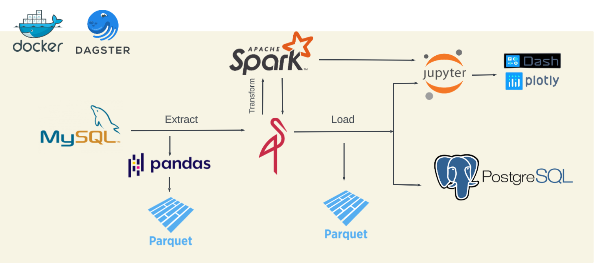
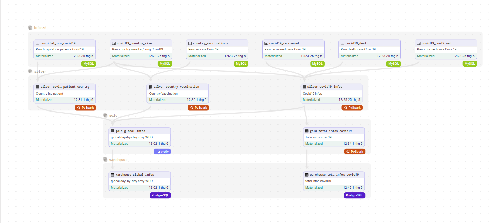
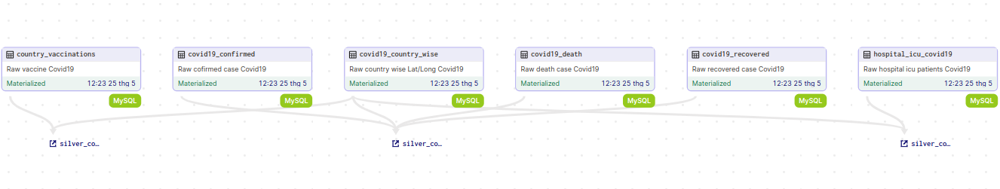
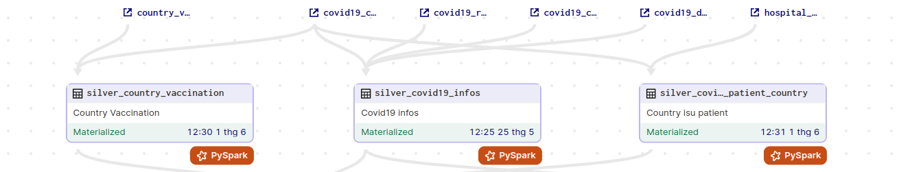
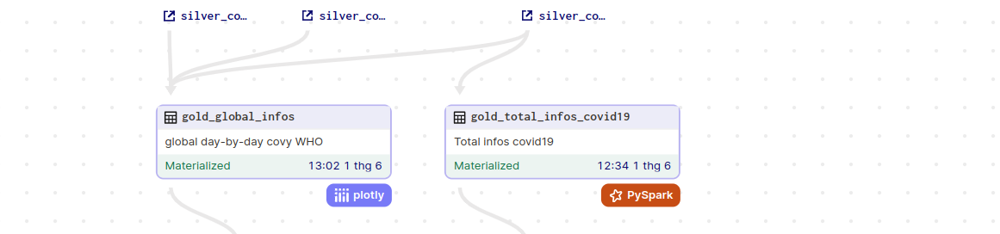
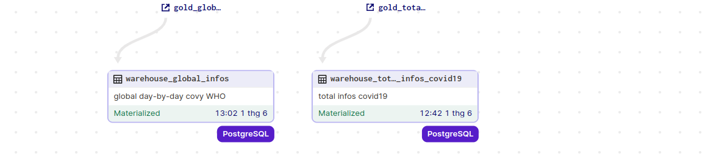
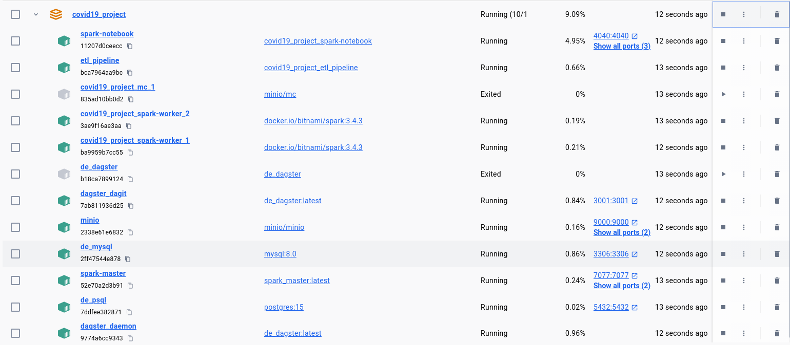

# Pandemic-Data-ETL

In this project, I will guide you through designing an ETL (Extract, Transform, Load) process focused on Covid19. Leveraging datasets sourced from Kaggle and Github, we will extract relevant data, perform necessary transformations, and finally load the processed data into the data warehouse. This process aims to streamline the analysis of Covid19-related data, providing insights into the impact of the pandemic.


# Goal of Project
The project aims to develop a dashboard featuring a map visualization to depict the progression of death cases over time in each region. Additionally, it will display the total number of confirmed deaths, recoveries, for each region.
# Pipeline Design



1. We use docker to containerize the application and dagster to orchestrate assets.
2. Covid19 data is downloaded from Kaggle and Github in .csv format, then imported into MySQL to simulate development data.
3. Extract the table-formatted data above using pandas, and load it into MinIO.
4. From MinIO, load data into Spark to transform from raw into silver & gold
5. Convert Spark DataFrame to .parquet, and load back to MinIO
6. Load gold layer into data warehouse - postgreSQL, creating the warehouse layer.
7. Utilize Jupyter notebooks for data visualization using Spark and Plotly, and develop interactive dashboards using Dash.

# Data lineage
1. General


2. Bronze layer

- **country_vaccinations**: Table country_vaccinations from MySQL.
- **covid19_confirmed**: Table covid19_confirmed from MySQL.
- **covid19_death**: Table covid19_death from MySQL.
- **covid19_recovered**: Table covid19_recovered from MySQL.
- **covid19_country_wise**: Table covid19_country_wise from MySQL.
- **hospital_icu_covid19**: Table hospital_icu_covid19 from MySQL.

3. Silver layer

- **silver_country_vaccination**:Data cleaning from upstream country_vaccinations and covid19_country_wise.
- **silver_covid19_infos**:Data collecting from upstream covid19_confirmed,covid19_death,covid19_recovered and covid19_country_wise.
- **silver_covid19_isu_patient_country**:Data cleaning from upstream hospital_icu_covid19 and covid19_country_wise.
   
4. Gold layer

- **gold_global_infos**: Contains basic information about Covid-19 such as vaccine, isu_patient, confirmed, recovered, death, WHO_region, and region.
- **goal_total_infos_covid19**: Contains total death, recovered, confirmed, and WHO_region for each region.

5. Warehouse layer

- Load the assets from the gold layer into PostgreSQL.

# Setup local infrastructure
### Clone repository:

```bash
git clone https://github.com/GiaPhus/Pandemic-Data-ETL.git
cd Pandemic-Data-ETL
```

### Create env file
```plaintext
touch .env
```

Subsequently, populate the relevant information into .env as outlined above:
### Project Configuration

```plaintext
# Minio
MINIO_ENDPOINT_URL=minio:9000
MINIO_ROOT_USER=
MINIO_ROOT_PASSWORD=
MINIO_ACCESS_KEY=
MINIO_SECRET_KEY=
MINIO_BUCKET_NAME=warehouse

# MySQL
MYSQL_HOST=de_mysql
MYSQL_PORT=3306
MYSQL_DATABASE=
MYSQL_PASSWORD=
MYSQL_ROOT_PASSWORD=
MYSQL_USER=

# PostgreSQL
POSTGRES_HOST=de_psql
POSTGRES_PORT=5432
POSTGRES_DB=covid_19_warehouse
POSTGRES_USER=
POSTGRES_PASSWORD=
POSTGRES_HOST_AUTH_METHOD=

# Dagster
DAGSTER_PG_HOSTNAME=de_psql
DAGSTER_PG_USERNAME=
DAGSTER_PG_PASSWORD=
DAGSTER_PG_DB=covid_19_warehouse
DAGSTER_OVERALL_CONCURRENCY_LIMIT=1
DAGSTER_HOME=/opt/dagster/dagster_home

# Spark
SPARK_MASTER_URL=spark://spark-master:7077
SPARK_VERSION=3.4.3
HADOOP_VERSION=3
SPARK_MODE=master
SPARK_RPC_AUTHENTICATION_ENABLED=no
SPARK_RPC_ENCRYPTION_ENABLED=no
SPARK_LOCAL_STORAGE_ENCRYPTION_ENABLED=no
SPARK_SSL_ENABLED=no
SPARK_MASTER_IP=spark-master
SPARK_MASTER_PORT=7077
```


You can replace the infomation about user, password, ...

Check there's 10 running services:




### Ports:

    MySQL: 3306
    PostgreSQL: 5432
    Dagit: 3001
    MinIO
        UI: 9001
        API: 9000
    Spark master:
        UI: 8080
        API: 7077
    Dash: 8050
    Jupyter notebook: 8888
      Spark jobs running: 4040

### User interfaces:
    http://localhost:3001 - Dagit
    http://localhost:4040 - Spark jobs
    http://localhost:8080 - Spark master
    http://localhost:9001 - MinIO
    http://localhost:8888 - Jupyter notebook
    http://localhost:8050 - Dash

# Technologies Used:
- Dagster: Empowering data orchestration for machine learning, analytics, and ETL pipelines.
- Spark: Utilized as an open-source distributed computing system for large-scale data processing.
- MySQL: A trusted open-source relational database management system.
- PostgreSQL: Leveraged as an open-source relational database management system.
- MinIO: Serving as an open-source object storage server.
- Plotly: Offering an open-source library for interactive data visualization.
- Dash: Enabling the development of analytical web applications through an open-source Python framework.
- Pandas: Empowering data manipulation and analysis through an open-source Python library.

# Source : 
Cre(Kaggle Dataset): https://www.kaggle.com/datasets/imdevskp/corona-virus-report?select=country_wise_latest.csv

Cre(Github Dataset): https://github.com/owid/covid-19-data/blob/master/public/data/archived/who/full_data.csv 


